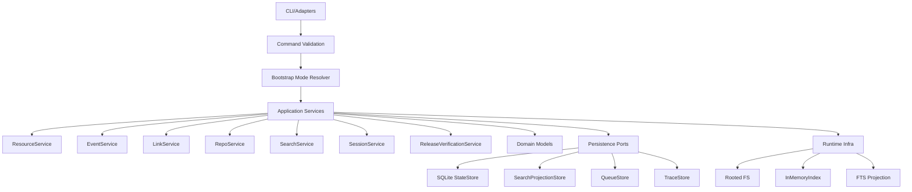

# Implementation Spec

## 목표
- AxiomSync를 로컬 퍼스트 context runtime + operator CLI로 안정화한다.
- `axiom://`, `context.db`, `memory_only retrieval`, `session/OM state`, `v3 resources/events/links` 계약을 장기 유지 가능한 형태로 고정한다.
- 릴리스/문서/API 계약을 일치시킨다.
- 현재 구조를 유지하면서도 확장 가능한 내부 경계를 만든다.

## 비목표
- 웹 viewer 구현
- 모바일 FFI 설계
- 외부 companion repo 구현
- retrieval backend를 SQLite query runtime으로 전환
- vendored OM 엔진을 이 저장소 밖으로 이동

## 현재 상태 요약
- 단일 Rust package `axiomsync`
- runtime + CLI + ops/release surface를 한 크레이트가 소유
- `<root>/context.db` 단일 저장소
- runtime query path는 `memory_only`
- persisted search projection은 `search_docs` 및 `search_docs_fts`
- canonical search result는 `FindResult.query_results` + `hit_buckets`
- 호환성 직렬화는 `memories/resources/skills`
- thin facade에서 internal service delegate를 통해 `event/link/repo/archive` 기능 제공
- quality/release gate shell script는 orchestration만 담당하고 정책 검사는 Rust test/command로 검증

## 문제 정의
- 릴리스 라인과 실제 GitHub release가 불일치한다.
- 문서 인덱스와 실제 문서 트리가 불일치한다.
- 단일 크레이트에 책임이 과밀하다.
- canonical API와 compatibility API가 섞여 있다.
- planner가 단일 primary scope 한계를 가진다.
- migration/repair가 운영 도구로 충분히 드러나지 않는다.

## 설계 원칙
- **정본 우선**: SQLite가 source of truth다.
- **런타임은 파생 계층**: in-memory index와 FTS는 복원/가속 계층이다.
- **계약 단일화**: canonical public contract는 하나만 둔다.
- **호환성은 별도 계층**: legacy JSON은 presentation responsibility다.
- **명시적 부팅**: bootstrap과 runtime prepare는 분리한다.
- **진단 가능성**: migration/release/retrieval 상태는 JSON으로 진단 가능해야 한다.
- **진화 우선**: 구조를 갈아엎지 않고 단계적으로 분리한다.

## 목표 아키텍처

## 모듈별 책임

### `src/client.rs`
- composition root
- service graph wiring
- runtime lifecycle only

### `src/client/runtime.rs`
- bootstrap/prepare_runtime/reindex/restore orchestration
- no CLI formatting

### `src/client/facade.rs`
- explicit service accessor
- thin delegate only

### `src/state/*`
- SQLite persistence
- projection writes
- schema/migration/repair helpers

### `src/retrieval/*`
- query planning
- ranking
- trace
- scope routing

### `src/models/*`
- pure data contracts
- serde shape
- no runtime policy

### `src/cli/*`, `src/commands/*`
- argument parsing
- output formatting
- preflight validation
- no persistence logic

### `src/release_gate/*`
- executable policy
- JSON evidence
- no shell-specific policy logic

## 데이터 모델 변경안

### 유지
- `context.db`
- `resources`, `events`, `links`
- `search_docs`, `search_docs_fts`
- `system_kv`

### 변경
- **api_result_presentations** 개념 도입
    - core model: `FindResult`
    - compat presenter: `FindResultCompatView`
- **system_kv** 키 정리
    - `context_schema_version`
    - `search_docs_fts_schema_version`
    - `index_profile_stamp`
    - `release_contract_version`
- **archive flow** 메타 강화
    - `archive_plan_id`
    - `archived_by`
    - `archive_reason`
    - `archive_generated_at`
- **migration audit trail** 추가
    - `schema_migration_runs`
    - `repair_runs`

## API/계약 변경안

### 검색 API
- **현재**: `find`, `search`, `search_with_request`
- **변경**:
    - 유지하되, public JSON 기본 출력은 **canonical only**
    - `--compat-json`일 때만 legacy arrays 포함
    - **trace**에 아래 필드 추가:
        - `scope_decision`
        - `filter_routing_reason`
        - `restore_source`
        - `fts_fallback_used`

### 이벤트 API
- **현재**: `add_event`, `add_events`, `export_event_archive`
- **변경**:
    - `export_event_archive`를 다음으로 분리:
        - `plan_event_archive(query)` -> `ArchivePlan`
        - `execute_event_archive(plan_id|plan)` -> `EventArchiveReport`

### 운영 API
- **추가**:
    - `doctor storage --json`
    - `doctor retrieval --json`
    - `migrate inspect --json`
    - `migrate apply --backup-dir ... --json`
    - `release verify --json`

### 완료 기준

- mixed intent query 테스트 존재
- release verify JSON이 schema/index/fts/version 상태를 모두 포함
- shell script는 orchestration만 담당

### 완료 판정 기준

다음이 모두 만족되면 완료로 본다.

- 검색 public contract가 canonical 하나로 정리된다.
- compat output은 명시적 opt-in으로만 남는다.
- facade 책임이 내부 서비스로 분리된다.
- migration/repair/release verification이 실행 가능한 명령으로 제공된다.
- clean-root에서 init -> ingest -> search -> event -> archive -> release verify가 통과한다.
- planner/FTS/index drift 관련 회귀 테스트가 존재한다.
